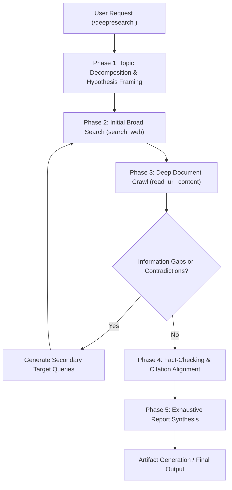

# Architecture & Operational Runbook for Deep Research Engine

## 1. Overview
The Deep Research engine transforms Antigravity into an autonomous research analyst modeled after Gemini Deep Research. Rather than returning surface-level search snippets, it executes multi-hop investigations across the web and local codebases, iteratively discovering, filtering, cross-verifying, and synthesizing complex engineering knowledge into exhaustive technical reports.

---

## 2. Deep Research Operating Pipeline

---

## 3. Investigation Methodology

### Phase 1: Query Decomposition
1. Identify the core inquiry, underlying technologies, and implied architectural tradeoffs.
2. Break the topic into 3–5 orthogonal sub-questions:
   - *Mechanistic Core:* How does the protocol, algorithm, or framework function internally?
   - *Comparative Benchmarks:* What empirical metrics (latency, memory, throughput) differentiate alternatives?
   - *Edge Cases & Failure Modes:* What are the documented failure modes, limitations, or security vulnerabilities?
   - *Production Standards:* What are the current industry best practices and canonical configs?

### Phase 2: Iterative Search & URL Reading
1. Execute search queries with diverse keywords, operators, and site targets (`github.com`, `arxiv.org`, `docs.*`, official RFCs).
2. For top relevant sources, fetch the raw content via `read_url_content` or `read_browser_page`.
3. Extract precise details:
   - Exact CLI parameters, struct definitions, configuration flags.
   - Empirical numbers and benchmark test harnesses.
   - Authoritative quotes from maintainers or RFC authors.

### Phase 3: Gap Analysis & Recursive Search
1. Review gathered notes against the sub-questions.
2. If any sub-question remains ambiguous or has conflicting answers:
   - Formulate a hyper-targeted query.
   - Search specifically for the discrepancy (e.g. `"X vs Y benchmark overhead"` or `"CVE-XXXX-XXXX mitigation"`).

### Phase 4: Report Synthesis Standards
The final research output must adhere to the following publication standards:
- **No Vague Generalities:** Use concrete names, versions, code snippets, and numbers.
- **Visual Synthesis:** Include at least one Mermaid architecture diagram or flowchart.
- **Comparative Tables:** Format key comparisons in GitHub markdown tables.
- **Citations:** Every non-obvious assertion must be attributed to an exact markdown URL link `[Source Name](https://...)`.
